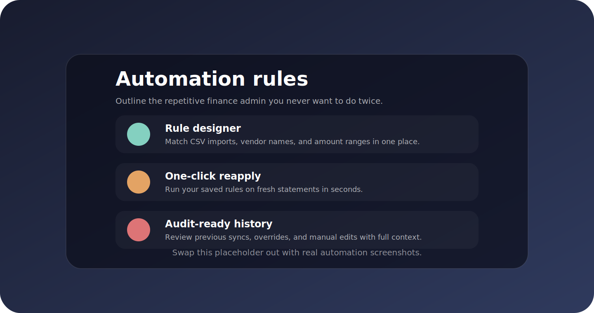

<div align="center">
  <h1>CashTrack</h1>
  <p><strong>Offline-first household finance dashboard built with Next.js 14</strong></p>
  <p>
    <a href="https://nodejs.org/en/download">
      
    </a>
    <a href="https://nextjs.org/">
      
    </a>
    <a href="./docs/LOCAL_INSTALLATION.md">
      
    </a>
  </p>
  <p>
    Track spending, automate categorisation rules, and sync a shared SQLite ledger across your household &mdash; even without an internet connection.
  </p>
</div>


> 🖼️ **Screenshot placeholder** &mdash; swap `docs/media/dashboard-preview-placeholder.svg` with a real dashboard capture when you are ready.

---

## Table of contents

- [Feature highlights](#feature-highlights)
- [Quick start](#quick-start)
- [Screenshots & walkthrough](#screenshots--walkthrough)
- [Architecture at a glance](#architecture-at-a-glance)
- [Syncing and backups](#syncing-and-backups)
- [Desktop distribution](#desktop-distribution)
- [Available scripts](#available-scripts)
- [Further reading](#further-reading)

## Feature highlights

| ✨ | What you get | Why it matters |
| --- | --- | --- |
| 🛡️ **Offline-first core** | SQLite + iron-session keep every transaction on disk and encrypted cookies stay local. | Works in airplane mode, on a NAS, or behind firewalls with no cloud dependency. |
| 📈 **Insightful dashboards** | Category drilldowns, rolling cash-flow charts, and balance summaries driven by SQL views. | Understand where money moves over time instead of staring at static CSV exports. |
| 🤖 **Automation rules** | Reapply saved mappings to new statements, match on merchant names, and fine-tune categories. | Skip repetitive bookkeeping and keep your ledger consistent across imports. |
| 🌐 **LAN sync APIs** | Authenticated `/api/sync/{pull,push,export,import}` endpoints plus UI toggles for discovery. | Share updates between laptops or a home server without exposing data to the internet. |
| 🪟 **Windows tooling** | Build portable bundles, install a Windows Service, and generate an Inno Setup installer. | Ship CashTrack as a desktop app for family members who just want a shortcut. |
| 🔐 **Privacy by default** | No analytics, PWA install prompts, and configurable data directories. | Maintain full control over where your household data lives. |

## Quick start

> Looking for the full walkthrough? Jump to the [Local Installation Guide](./docs/LOCAL_INSTALLATION.md).

### 1. Install dependencies

```bash
npm install
```

### 2. Configure your environment

Copy `.env.example` to `.env.local` (or `.env`) and set a strong session secret. All data lives inside `CASHTRACK_DATA_DIR` (defaults to `./data`).

```bash
cp .env.example .env.local
# Generate a 32-byte secret on macOS/Linux and append it to the file:
echo "CASHTRACK_SESSION_SECRET=$(openssl rand -base64 32)" >> .env.local
```

Add or edit the following keys:

```env
CASHTRACK_SESSION_SECRET=replace-me-with-a-strong-random-value
CASHTRACK_DATA_DIR=./data
SYNC_HOST=http://192.168.1.10:3000  # optional: customise the discovery banner shown to the household
```

### 3. Prepare the database

```bash
npm run db:migrate
```

The migration script creates the SQLite schema, imports any `data/*.json` seed files, and provisions the default household account.

### 4. Run CashTrack locally

```bash
npm run dev
```

Visit `http://localhost:3000`, sign in with the default credentials (`household` / `cashtrack`), and update the password from **Settings → Household account**. The middleware blocks access to the rest of the UI until every member has changed it.

## Screenshots & walkthrough

<div align="center">
  
  <p><em>Replace with automation, import, and budgeting screenshots as you collect them.</em></p>
</div>

Use this section to collect real screenshots of the dashboard, automation designer, import flows, and mobile layouts. Include short captions so new users understand what they are seeing at a glance.

## Architecture at a glance


- **Data directory:** `CASHTRACK_DATA_DIR` defaults to `./data` relative to the app root.
- **Sessions:** iron-session encrypts cookies using `CASHTRACK_SESSION_SECRET`.
- **Offline support:** `public/sw.js` caches assets and recent API responses to keep reports responsive without Wi-Fi.

## Syncing and backups

- Toggle **Allow LAN sync** inside Settings to expose the `/api/sync/*` endpoints to authenticated household members.
- Pull incremental changes from another device: `GET /api/sync/pull?since=<ISO timestamp>`.
- Push merges back: `POST /api/sync/push` with an authenticated session cookie.
- Export a JSON snapshot: `GET /api/sync/export`.
- Restore a snapshot: upload it through Settings or send it to `POST /api/sync/import`.
- Automated backup schedules are stored inside the `settings` table; trigger exports using your platform's scheduler.

## Desktop distribution

1. **Build a production bundle**
   ```bash
   npm run build:desktop
   ```
   - Outputs the optimised Next.js build under `release/windows/app`.
   - Copy a portable Node.js runtime into `release/windows/runtime` or set `CASHTRACK_NODE_RUNTIME` before running the script.
2. **Install as a Windows service**
   ```bash
   npm run service:install
   ```
   - Registers the **CashTrack Local Server** service and stores data under `%PROGRAMDATA%\CashTrack\data`.
   - Use `npm run service:uninstall` to remove it.
3. **Create an installer (optional)**
   - Open `installer/windows/CashTrackInstaller.iss` in Inno Setup to package the bundle.
   - The installer copies files to `%ProgramFiles%/CashTrack`, registers the service, and creates shortcuts that open `http://localhost:3000`.

## Available scripts

```bash
npm run dev            # Start the Next.js dev server with hot reloading
npm run db:migrate     # Initialise the SQLite database and import seed data
npm run lint           # Run ESLint + TypeScript checks
npm run build          # Production build used by build:desktop
npm run build:desktop  # Prepare the Windows-ready bundle
npm run service:install   # Install the Windows background service
npm run service:uninstall # Remove the Windows background service
```

## Further reading

- [Local installation guide](./docs/LOCAL_INSTALLATION.md)
- [Features overview](./Features.md)
- [Component catalogue](./components/README.md) *(if available)*

Ready to contribute? Open an issue or start a discussion describing how you use CashTrack in your household setup.
